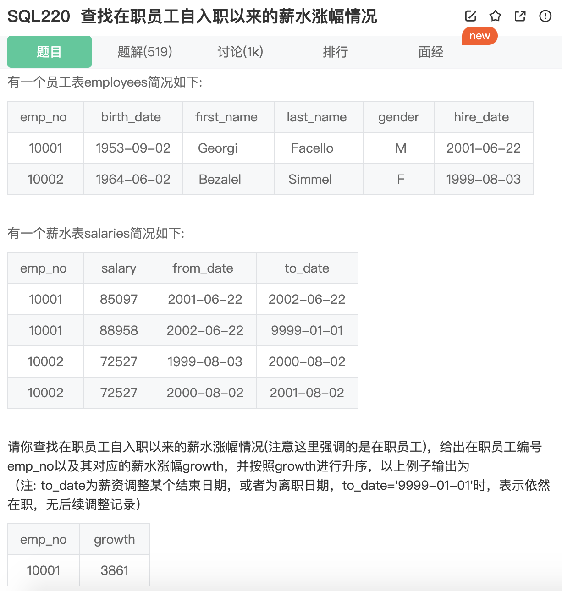

[**SQL220** **查找在职员工自入职以来的薪水涨幅情况**](**SQL220** **查找在职员工自入职以来的薪水涨幅情况**)

状态：

未通过 2025/03/04



有几个需要注意的问题：

1. 寻找在职员工，也就是说离职日期为‘9999-01-01’
2. 其实无需和emp表进行join
3. 写的时候有些畏难，过分追求简洁，但是窗口函数也没有写出来
4. 实际思路可以利用多个表来表示不同的内容
5. 自连接！！！巧妙利用自连接来算出差值
6. 既然可以使用自连接，利用窗口函数算累差是不是也可以！
7. NULL不会影响SUM，但是在与数字做加减乘除等运算时会导致返回结果变为None，必要时记得用coalesce处理。
8. 还有一种方法是利用员工表，表中的hire_date可以用来计算最初的工资，再利用to_date计算当前的工资，进行join求差值。

```sql
-- 自连接
WITH help1 AS (
    SELECT emp_no
    FROM salaries
    WHERE to_date = '9999-01-01'
)
SELECT 
    s1.emp_no,
    SUM(s2.salary - s1.salary) AS growth
FROM salaries s1, salaries s2
WHERE s1.emp_no IN (SELECT emp_no FROM help1)
    AND s1.to_date = s2.from_date
GROUP BY s1.emp_no
ORDER BY growth ASC
```

```sql
-- 窗口函数
WITH
    help1 AS (
        SELECT
            emp_no
        FROM
            salaries
        WHERE
            to_date = '9999-01-01'
    ),
    salary_diff AS (
        SELECT
            s1.emp_no,
            s1.salary,
            s1.from_date,
            s1.salary - LAG(s1.salary) OVER (
                PARTITION BY
                    s1.emp_no
                ORDER BY
                    s1.from_date ASC
            ) AS prev_salary
        FROM
            salaries s1
        WHERE
            s1.emp_no IN (
                SELECT
                    emp_no
                FROM
                    help1
            )
    )
SELECT
    emp_no,
    SUM(prev_salary) AS growth
FROM
    salary_diff
GROUP BY
    emp_no
ORDER BY
    growth ASC;
```

